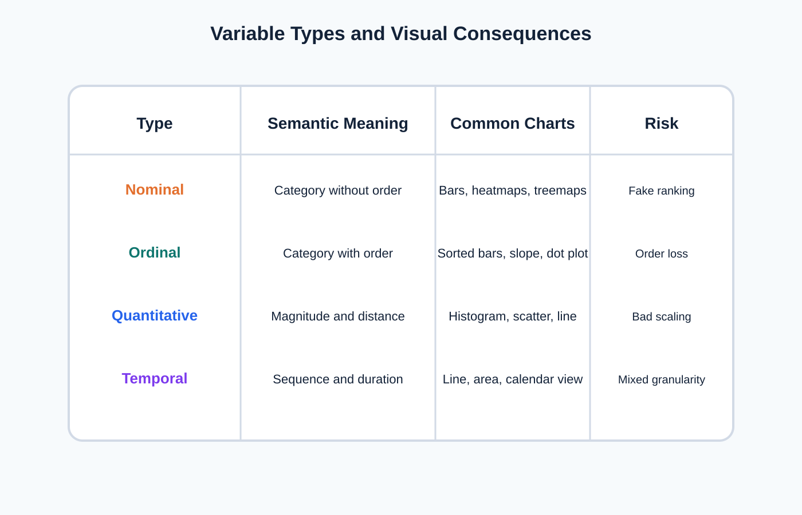
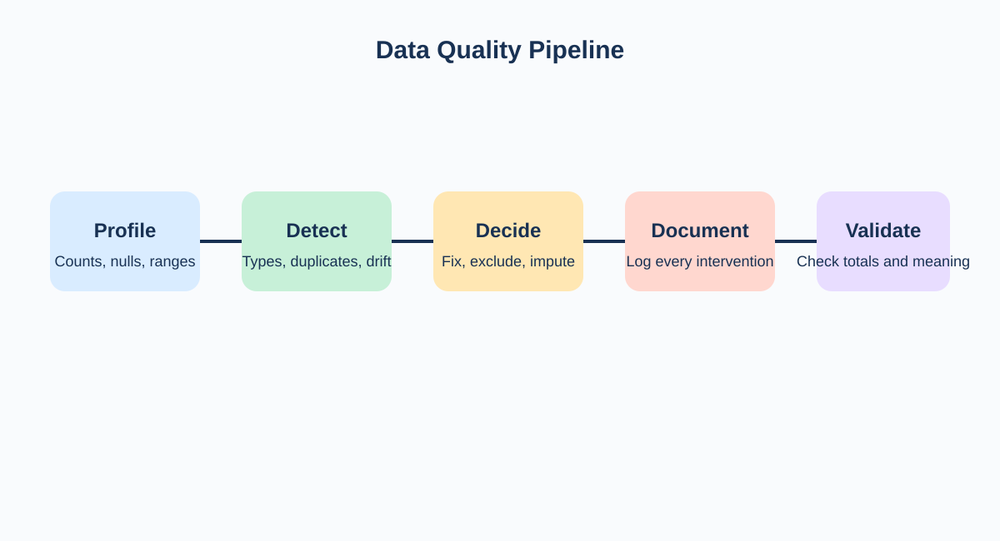

<!-- _class: lead -->
# Semana 2
## Perfilado del dato, granularidad y lectura estructural

- Idea clave: no se puede visualizar bien lo que no se ha comprendido estructuralmente
- Resultado esperado: diagnostico tecnico de la fuente

---

## Objetivos de la semana

- Identificar la **unidad de analisis** exacta del dataset.
- Distinguir tipos de variables y sus implicancias visuales.
- Medir completitud, cardinalidad, nulos y consistencia.
- Introducir nociones minimas de **gobierno del dato**: trazabilidad, metadata y diccionario.
- Traducir el perfilado en decisiones sobre que preguntas son validas.

---

## Agenda sugerida de las 4 horas

| Tramo | Tiempo | Actividad |
|---|---:|---|
| Apertura | 0:00 - 0:20 | Recap de la semana 1 y pregunta analitica del dia |
| Teoria | 0:20 - 1:10 | Unidad de analisis, granularidad, tipos de variable y gobierno minimo |
| Demo | 1:10 - 2:00 | Perfilado en Tableau y lectura de metadatos |
| Laboratorio | 2:00 - 3:25 | Tabla de perfilado, nulos, cardinalidad, riesgos de interpretacion |
| Cierre | 3:25 - 4:00 | Puesta en comun y definicion de preguntas viables |

---

## Fundamento teorico

- El **perfilado** es una descripcion sistematica de la fuente antes de intervenirla.
- La pregunta critica no es "que contiene la tabla", sino:
  - que representa cada fila
  - que significan las columnas
  - que operaciones son validas
  - que comparaciones estan autorizadas por la estructura
- Una visualizacion puede ser formalmente correcta pero semanticamente invalida si ignora granularidad.

---

## Tipos de variables y consecuencias visuales

- Nominal: compara categorias.
- Ordinal: exige preservar orden.
- Cuantitativa: admite distancia y distribucion.
- Temporal: impone secuencia y continuidad.

---

## Granularidad: concepto decisivo

- La **granularidad** es el nivel de detalle al que esta representado el dato.
- Ejemplos:
  - una fila = una venta
  - una fila = un paciente
  - una fila = un resumen mensual
- Implicancias:
  - cambia la validez de promedios y sumas
  - condiciona comparaciones temporales
  - determina si un join posterior es seguro o riesgoso

---

## Pipeline de perfilado y lectura estructural

- Observar antes de limpiar.
- Medir antes de decidir.
- Validar antes de visualizar.

---

## Gobierno minimo del dato

- Todo dataset del curso debe tener:
  - nombre de fuente
  - fecha de descarga o corte
  - responsable o procedencia
  - diccionario simplificado
  - reglas de limpieza aplicadas
- La trazabilidad no es burocracia: protege la interpretacion y la reproducibilidad.

---

## Checklist tecnico de perfilado

- Conteo total de registros.
- Numero de columnas.
- Tipo inferido vs tipo esperado.
- Porcentaje de nulos por columna.
- Cardinalidad de variables categoricas.
- Rango de medidas numericas.
- Valores extremos sospechosos.
- Validez de fechas y campos geograficos.

---

## Metricas de perfilado que conviene calcular siempre

| Metrica | Que revela | Riesgo si se ignora |
|---|---|---|
| `% nulos` | Completitud | Comparaciones sesgadas |
| `count distinct` | Cardinalidad | Saturacion de categorias |
| `min/max` | Plausibilidad | Errores de escala |
| `mean/median` | Tendencia central | Colas y asimetria ocultas |
| `std / IQR` | Dispersion | Falsa homogeneidad |

---

## Perfilado en Tableau

- Revisar campos como:
  - `dimension`
  - `measure`
  - `continuous`
  - `discrete`
- Confirmar jerarquias:
  - fecha
  - geografia
- Construir vistas rapidas de inspeccion:
  - frecuencia de categorias
  - histograma inicial
  - tabla de nulos o faltantes

---

## Caso aplicado: no es lo mismo transaccion que agregado

- Dataset A:
  - una fila = una venta
- Dataset B:
  - una fila = ventas totales por mes y categoria
- Consecuencias:
  - en A puedo ver dispersion y outliers por transaccion
  - en B ya perdi variabilidad individual
  - en A puedo construir cohortes o tickets
  - en B solo puedo trabajar con agregados ya fijados

---

## Laboratorio guiado

1. Crear una tabla de perfilado.
2. Documentar por columna:
   - significado
   - tipo esperado
   - tipo actual
   - completitud
   - observaciones
3. Detectar al menos tres riesgos de interpretacion.
4. Formular tres preguntas analiticas viables y tres no viables.

---

## Errores frecuentes

- Tratar identificadores como medidas.
- Agregar promedios sobre datos ya agregados.
- Suponer que los nulos significan lo mismo en todas las columnas.
- Leer una tabla resumen como si fuese transaccional.

---

## Preguntas de comprobacion conceptual

- Cual es la unidad de analisis del dataset?
- Que variable parece numerica pero en realidad funciona como identificador?
- Que comparacion seria engañosa si se hiciera con esta fuente?
- Que campos requieren diccionario o metadata adicional?

---

## Referencias

- Munzner, *Visualization Analysis and Design*
- Wickham, *Tidy Data*
- Few, *Show Me the Numbers*
