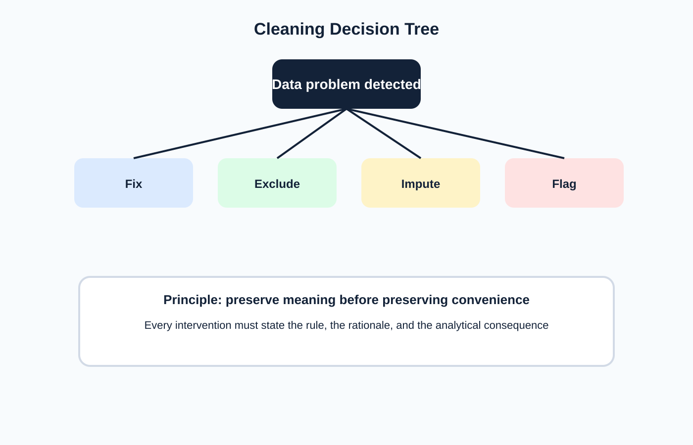

<!-- _class: lead -->
# Semana 3
## Limpieza y preparacion de datos

- La limpieza no es cosmetica: altera el significado de lo que luego se visualiza
- Meta: dejar una fuente interpretable, consistente y documentada

---

## Objetivos de la semana

- Corregir tipos, categorias, fechas y faltantes.
- Distinguir problemas que se resuelven dentro de Tableau y fuera de Tableau.
- Crear una bitacora reproducible de preparacion.

---

## Agenda sugerida de las 4 horas

| Tramo | Tiempo | Actividad |
|---|---:|---|
| Apertura | 0:00 - 0:20 | Recap del perfilado y definicion de problemas a intervenir |
| Teoria | 0:20 - 1:15 | Tipologia de problemas y costos epistemicos de limpiar |
| Demo | 1:15 - 2:00 | Limpieza en Tableau, Excel y opcion reproducible con Python |
| Laboratorio | 2:00 - 3:25 | Correccion de tipos, categorias, nulos y bitacora |
| Cierre | 3:25 - 4:00 | Discusion de decisiones y su impacto analitico |

---

## Fundamento teorico

- Limpiar implica tomar decisiones que afectan:
  - comparabilidad
  - distribucion
  - agregacion
  - narrativa final
- Principio rector:
  - **preservar significado antes que preservar comodidad**
- Toda intervencion debe responder:
  - que problema habia
  - que regla se aplico
  - por que se aplico
  - que efecto produce

---

## Tipologia de problemas de limpieza

- Tipos mal inferidos.
- Etiquetas sucias:
  - sinonimos
  - errores tipograficos
  - abreviaciones
- Nulos y ausencias.
- Duplicados exactos y funcionales.
- Formatos inconsistentes:
  - moneda
  - porcentaje
  - fecha
  - codigo

---

## Arbol de decision para intervenir

- Opciones validas:
  - corregir
  - excluir
  - imputar
  - etiquetar
- Cada una tiene costo epistemico distinto.

---

## Limpieza en Tableau y fuera de Tableau

- En Tableau:
  - cambio de tipo
  - aliases
  - split
  - pivot / unpivot
  - renombrado
- En `Excel` o `Python`:
  - normalizacion masiva
  - reglas complejas
  - transformaciones reproducibles
- Regla practica:
  - si la limpieza es estructural o extensa, conviene dejarla fuera del workbook.

---

## Estrategias para nulos y faltantes

| Situacion | Opcion posible | Riesgo |
|---|---|---|
| Ausencia real | Etiquetar `Missing` | Reinterpretacion simplista |
| Error tecnico | Corregir desde fuente | Requiere trazabilidad |
| Dato no aplicable | Mantener como NA | Comparabilidad desigual |
| Pequeño porcentaje | Excluir | Sesgo si no es aleatorio |
| Serie numerica | Imputar | Fabricar patron inexistente |

---

## Imputacion: cuando ayuda y cuando perjudica

- Puede ser razonable cuando:
  - el porcentaje faltante es bajo
  - existe criterio sustantivo
  - el objetivo es continuidad operativa
- Puede ser peligrosa cuando:
  - altera distribucion
  - reduce varianza artificialmente
  - introduce una señal que el dato original no tenia
- Regla docente:
  - toda imputacion debe ir acompañada de justificacion y marca metodologica.

---

## Bitacora minima de preparacion

| Campo | Problema | Regla aplicada | Herramienta | Impacto esperado |
|---|---|---|---|---|
| `region` | Variantes de escritura | Homologacion | Tableau / Python | Comparacion estable |
| `fecha` | Texto heterogeneo | Parseo a fecha | Tableau | Serie temporal valida |
| `precio` | Simbolos y comas | Limpieza numerica | Python | Agregacion correcta |

---

## Laboratorio guiado

1. Corregir tipos de datos criticos.
2. Consolidar categorias inconsistentes.
3. Revisar y decidir tratamiento de nulos.
4. Comparar tabla antes vs despues.
5. Registrar en bitacora:
   - problema
   - decision
   - justificacion
   - impacto esperado

---

## Criterios de calidad

- Las categorias finales son estables?
- Las fechas son analizables?
- Las decisiones de limpieza son auditables?
- Los cambios no destruyeron informacion util?

---

## Errores frecuentes y lecturas

- Imputar sin explicitar supuestos.
- Eliminar outliers antes de entenderlos.
- "Arreglar" manualmente sin dejar rastro.
- Fusionar categorias por comodidad y no por teoria.

---

## Preguntas para discutir

- Que tipos de errores deben corregirse en origen y cuales pueden resolverse en una capa analitica?
- Cuando conviene dejar un valor como `NA` y no "arreglarlo"?
- Como cambia un dashboard si se consolidan mal categorias?

- Wickham, *Tidy Data*
- Few, *Show Me the Numbers*
