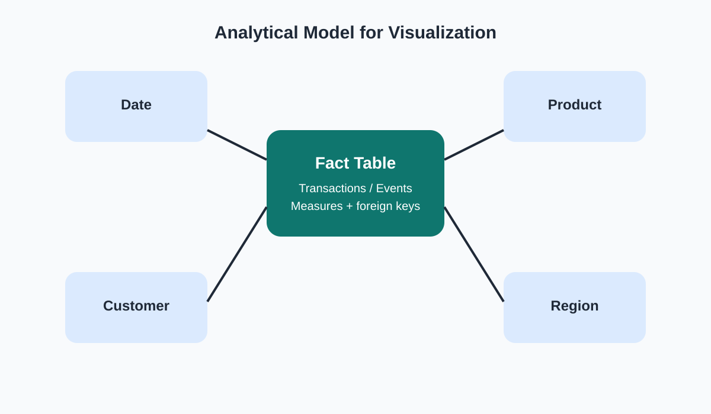
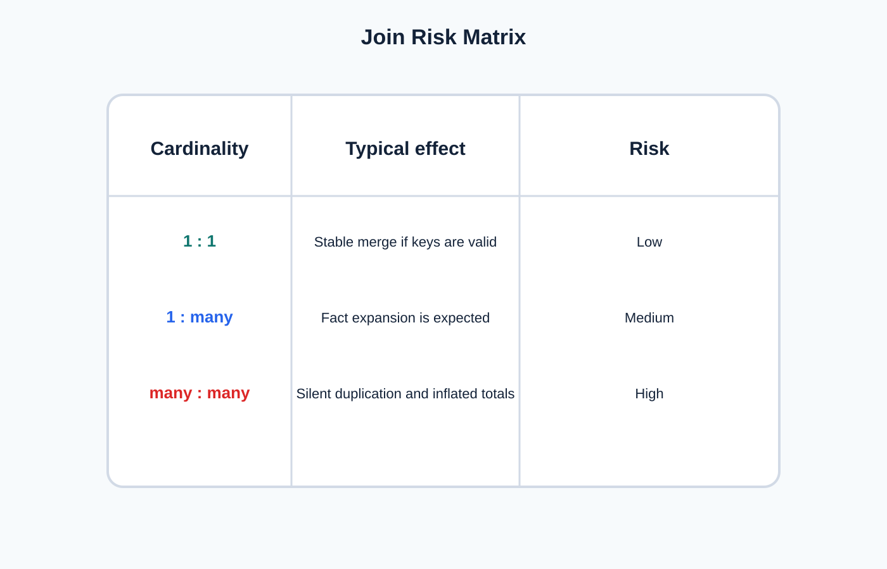

<!-- _class: lead -->
# Semana 4
## Modelado de fuentes para visualizacion

- Un dashboard puede fallar no por el grafico, sino por la logica relacional que lo sostiene
- Meta: construir una fuente analitica validada

---

## Objetivos de la semana

- Distinguir `join`, `union`, `relationship` y `blending`.
- Comprender riesgos de cardinalidad.
- Crear campos calculados basicos y jerarquias utiles.
- Validar conteos y totales despues del modelado.

---

## Agenda sugerida de las 4 horas

| Tramo | Tiempo | Actividad |
|---|---:|---|
| Apertura | 0:00 - 0:20 | Recap de limpieza y planteamiento del problema relacional |
| Teoria | 0:20 - 1:15 | Cardinalidad, joins, relationships y riesgos de duplicacion |
| Demo | 1:15 - 2:00 | Modelado en Tableau y validacion de totales |
| Laboratorio | 2:00 - 3:25 | Construccion de fuente analitica, jerarquias y calculos basicos |
| Cierre | 3:25 - 4:00 | Revision de anti patrones y chequeo de integridad |

---

## Fundamento teorico

- Visualizar exige una representacion fiel del espacio relacional.
- La pregunta central del modelado es:
  - **como evitar duplicar o perder significado cuando combino tablas?**
- El modelo correcto minimiza friccion analitica y evita errores invisibles.

---

## Esquema analitico recomendado

- Pensar en:
  - tabla de hechos
  - dimensiones de contexto
- Ejemplos de dimensiones:
  - fecha
  - region
  - cliente
  - producto

---

## Matriz de riesgo en joins

- `1:1`: bajo riesgo si la clave esta limpia.
- `1:many`: esperable en hechos y dimensiones.
- `many:many`: zona critica; requiere rediseño o tabla puente.

---

## Vocabulario minimo

| Operacion | Uso correcto | Riesgo tipico |
|---|---|---|
| Join | Combinar por clave | Inflar filas |
| Union | Apilar tablas homogeneas | Esquema incompatible |
| Relationship | Relacion flexible en Tableau | Confiar sin validar |
| Blending | Cruce entre fuentes distintas | Nivel de detalle ambiguo |

---

## Campos calculados y jerarquias

- Crear:
  - porcentaje
  - ratio
  - margen
  - bandera logica
- Definir jerarquias:
  - tiempo
  - geografia
  - producto
- Validar que la logica del calculo coincida con el nivel de la fuente.

---

## Como decidir entre join y relationship

- Usar `join` cuando:
  - el resultado final debe ser una tabla unificada
  - la cardinalidad esta controlada
  - necesito operar a nivel fila combinado
- Usar `relationship` cuando:
  - quiero preservar tablas separadas
  - cada vista puede resolver agregacion de forma contextual
  - el modelado logico es mas importante que el fisico

---

## Pruebas de validacion del modelo

1. Comparar conteo de filas antes y despues.
2. Comparar suma de una metrica critica.
3. Verificar numero de claves unicas.
4. Buscar duplicaciones por muestra manual.
5. Construir una vista de control por dimension principal.

---

## Laboratorio guiado

1. Conectar dos tablas relacionadas.
2. Elegir entre `join` y `relationship`.
3. Crear tres campos calculados.
4. Construir una jerarquia.
5. Validar:
   - numero de filas
   - totales de medidas
   - consistencia entre antes y despues

---

## Anti patrones clasicos

- Hacer joins sin conocer cardinalidad.
- Sumar medidas duplicadas sin advertirlo.
- Crear una dimension "limpia" que rompe trazabilidad.
- Modelar por conveniencia visual y no por coherencia semantica.

---

## Preguntas de chequeo

- Que pasaria con las ventas totales si el join multiplica filas?
- Como sabes que una relationship esta funcionando como esperas?
- En que casos una union es preferible a un join?

---

## Referencias

- Kimball, *The Data Warehouse Toolkit*
- Munzner, *Visualization Analysis and Design*
- Tableau Help, relaciones y modelado de datos
