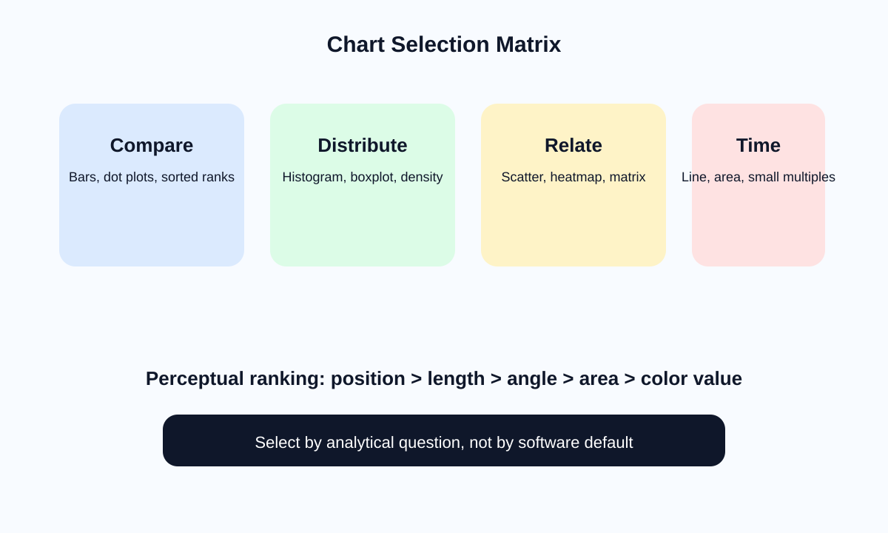

<!-- _class: lead -->
# Semana 5
## Visualizacion exploratoria y seleccion de graficos

- La eleccion del grafico no es estetica: es una hipotesis sobre como leer mejor el dato
- Meta: construir un workbook exploratorio base

---

## Objetivos de la semana

- Aplicar reglas de seleccion de graficos segun la tarea analitica.
- Usar principios perceptuales de Cleveland y McGill.
- Producir un conjunto coherente de hojas exploratorias.

---

## Agenda sugerida de las 4 horas

| Tramo | Tiempo | Actividad |
|---|---:|---|
| Apertura | 0:00 - 0:20 | Recap de modelado y pregunta analitica dominante |
| Teoria | 0:20 - 1:10 | Jerarquia perceptual y seleccion de graficos |
| Demo | 1:10 - 2:00 | Construccion guiada de barras, histogramas, scatter y lineas |
| Laboratorio | 2:00 - 3:25 | Workbook exploratorio con cinco hojas y justificacion |
| Cierre | 3:25 - 4:00 | Critica cruzada y descarte de vistas debiles |

---

## Fundamento teorico

- Las codificaciones visuales no tienen la misma precision.
- Jerarquia perceptual simplificada:
  - posicion comun
  - longitud
  - angulo
  - area
  - color
- Consecuencia:
  - para comparar magnitudes, preferir barras o dot plots antes que pastel o burbujas.

---

## Matriz de seleccion de graficos

- Comparacion -> barras, puntos, rankings
- Distribucion -> histogramas, boxplots
- Relacion -> dispersion, matrices
- Tiempo -> lineas, areas, small multiples

---

## Reglas teoricas por familia

- **Barras**: alta precision para ranking y comparacion categorial.
- **Histogramas**: revelan forma, dispersion y asimetria.
- **Boxplots**: resumen robusto y detection de outliers.
- **Scatter**: relacion, cluster, heterogeneidad.
- **Lineas**: cambio continuo en el tiempo.

---

## Como pensar la exploracion

- Explorar no es producir muchos graficos.
- Explorar bien exige:
  - preguntas concretas
  - iteracion rapida
  - comparaciones controladas
  - descarte de vistas redundantes
- Una buena hoja exploratoria deja claro:
  - que compara
  - a que escala
  - con que agregado

---

## Integridad visual: chart junk y distorsion

- Evitar:
  - 3D
  - sombras innecesarias
  - iconografia decorativa
  - leyendas redundantes
  - ejes truncados sin advertencia
- Principio:
  - si un elemento visual no mejora comprension, probablemente introduce ruido.

---

## Tabla de mapeo pregunta -> grafico

| Pregunta | Vista recomendada | Vista a evitar |
|---|---|---|
| Quien vende mas? | Barras ordenadas | Pie chart |
| Como se distribuye el ingreso? | Histograma / boxplot | Tabla sin resumen |
| Hay relacion entre precio y margen? | Scatter | Dos barras separadas |
| Como cambia por mes? | Linea | Barras desordenadas |

---

## Construccion tecnica en Tableau

- Hojas minimas:
  - comparacion categorial
  - distribucion
  - tendencia
  - relacion entre dos variables
  - ranking top N
- Ajustes obligatorios:
  - orden intencional
  - titulos claros
  - formato de ejes
  - tooltips sin ruido

---

## Laboratorio guiado

1. Construir al menos cinco hojas.
2. Nombrarlas segun la pregunta que responden.
3. Justificar verbalmente la codificacion elegida.
4. Descartar una vista innecesaria y reemplazarla por una mejor.

---

## Errores frecuentes

- Pie charts con demasiadas categorias.
- Demasiados colores sin semantica.
- Ejes truncados sin justificacion.
- Orden alfabetico donde deberia haber ranking.
- Varias vistas que responden la misma pregunta.

---

## Preguntas para discusion

- Que grafico elegirias si necesitas comparar 30 categorias?
- Cuando una tabla puede ser superior a un grafico?
- Que diferencia hay entre una vista para descubrir y una vista para demostrar?

---

## Referencias

- Cleveland, *The Elements of Graphing Data*
- Few, *Show Me the Numbers*
- Cairo, *The Functional Art*
