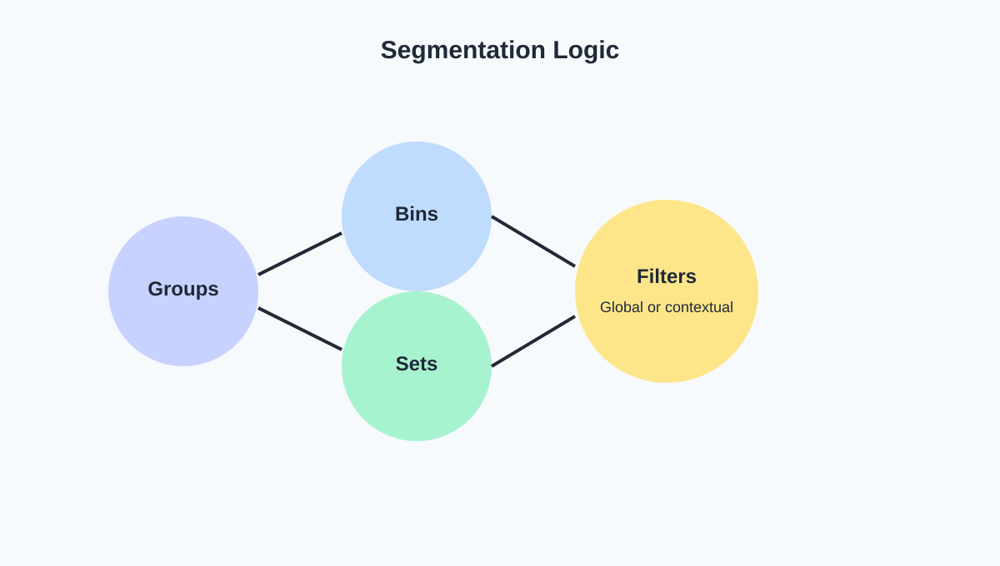
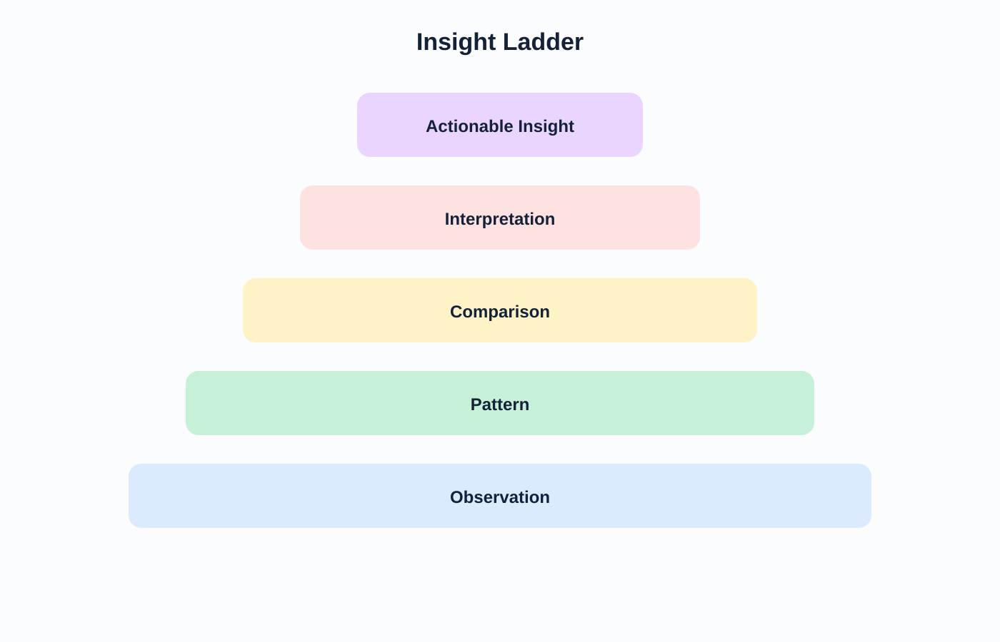

<!-- _class: lead -->
# Semana 6
## Segmentacion, comparaciones condicionales e insights

- El analisis mejora cuando comparamos subconjuntos con criterio
- Meta: pasar de vistas generales a hallazgos segmentados

---

## Objetivos de la semana

- Usar `filters`, `groups`, `sets` y `bins` con sentido analitico.
- Diferenciar observacion simple de insight util.
- Construir un dashboard exploratorio con segmentacion controlada.

---

## Agenda sugerida de las 4 horas

| Tramo | Tiempo | Actividad |
|---|---:|---|
| Apertura | 0:00 - 0:20 | Recap del workbook exploratorio y objetivos del dia |
| Teoria | 0:20 - 1:10 | Segmentacion, comparaciones condicionales e insight writing |
| Demo | 1:10 - 2:00 | `Filters`, `bins`, `groups`, `sets` y highlights en Tableau |
| Laboratorio | 2:00 - 3:25 | Dashboard exploratorio segmentado e insights escritos |
| Cierre | 3:25 - 4:00 | Discusion sobre correlacion, causalidad y riesgo inferencial |

---

## Fundamento teorico

- Analizar significa introducir comparaciones relevantes.
- La segmentacion vuelve visibles heterogeneidades que el agregado total oculta.
- Advertencia central:
  - correlacion visual no implica causalidad
  - pero puede sugerir patrones que merecen investigarse

---

## Logica de segmentacion

- `Groups`: condensan categorias semanticamente proximas.
- `Bins`: discretizan variables continuas.
- `Sets`: separan miembros relevantes del resto.
- `Filters`: alteran el universo observado y, por tanto, la interpretacion.

---

## De observacion a insight

- Una vista produce observaciones.
- Varias observaciones comparadas producen patrones.
- Los patrones interpretados y conectados con una decision producen insights.

---

## Escritura de insights

- Formula recomendada:
  - **En el segmento X, la metrica Y cambia Z frente a W, lo que sugiere...**
- Componentes minimos:
  - sujeto
  - comparacion
  - evidencia
  - implicancia
- Un buen insight no describe el grafico: interpreta su relevancia.

---

## Criterios para una buena segmentacion

- Relevancia sustantiva:
  - el segmento debe responder una pregunta real
- Estabilidad:
  - no debe depender de una separacion arbitraria
- Interpretabilidad:
  - el lector debe entender por que existe
- Accionabilidad:
  - debe habilitar una decision o una investigacion posterior

---

## Rubrica rapida para evaluar un insight

| Criterio | Bajo | Medio | Alto |
|---|---|---|---|
| Evidencia | Describe sin comparar | Compara parcialmente | Compara con claridad |
| Precision | Vaga | Parcial | Cuantificada |
| Implicancia | Ausente | Sugiere | Conecta con decision |
| Honestidad | Sobreinterpreta | Dudosa | Reconoce limites |

---

## Tecnicas en Tableau

- Quick filters y context filters.
- `Bins` para ingresos, edad, ticket o tiempo de permanencia.
- `Groups` para consolidar categorias.
- `Sets` para top vs rest, segmento critico vs resto.
- Highlight y drill-down para inspeccion puntual.

---

## Laboratorio guiado

1. Crear un dashboard con 3 o 4 vistas.
2. Agregar:
   - un filtro relevante
   - un set o group
   - un bin si el dato lo permite
3. Redactar tres insights apoyados por evidencia.

---

## Errores frecuentes

- Filtrar hasta perder contexto.
- Segmentar por variables irrelevantes.
- Llamar insight a cualquier observacion visual.
- Hacer afirmaciones causales a partir de un scatter.

---

## Preguntas para cierre de clase

- Que segmento revela mayor heterogeneidad y por que?
- Cual de tus insights podria defenderse ante un gerente?
- Que insight necesita evidencia adicional antes de presentarse como conclusion?

---

## Referencias

- Few, *Now You See It*
- Munzner, *Visualization Analysis and Design*
- Knaflic, *Storytelling with Data*
