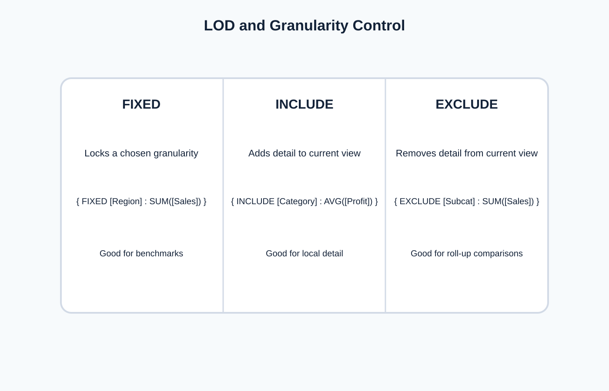

<!-- _class: lead -->
# Semana 7
## Calculos analiticos, parametros, table calculations y LOD

- Un dashboard riguroso explicita su logica de calculo
- Meta: incorporar analitica reproducible dentro del workbook

---

## Objetivos de la semana

- Diferenciar calculos por fila, agregados, de tabla y de nivel de detalle.
- Crear metricas derivadas bien definidas.
- Usar `LOD` para resolver preguntas de granularidad.

---

## Agenda sugerida de las 4 horas

| Tramo | Tiempo | Actividad |
|---|---:|---|
| Apertura | 0:00 - 0:20 | Recap del dashboard segmentado y problema de la granularidad |
| Teoria | 0:20 - 1:15 | Campos calculados, table calcs y `LOD` |
| Demo | 1:15 - 2:00 | Parametros, benchmarks y ejemplos de calculo en Tableau |
| Laboratorio | 2:00 - 3:25 | Construccion de metricas derivadas y explicacion del nivel de calculo |
| Cierre | 3:25 - 4:00 | Revision de formulas y chequeo de coherencia semantica |

---

## Fundamento teorico

- No todo calculo ocurre en el mismo nivel semantico.
- Pregunta directriz:
  - **donde se esta calculando realmente la metrica?**
- Si no se responde esto, el dashboard puede producir numeros plausibles pero conceptualmente equivocados.

---

## Mapa general de calculos

- `Calculated fields`: logica de negocio reusable.
- `Parameters`: control de escenarios.
- `Table calculations`: dependen de la vista.
- `LOD`: controlan granularidad analitica.

---

## LOD y control de granularidad

- `FIXED`: fija un nivel.
- `INCLUDE`: agrega detalle.
- `EXCLUDE`: elimina detalle.
- Principio: usar `LOD` solo cuando la pregunta lo exige claramente.

---

## Tecnicas concretas

- Campos calculados:
  - margen
  - ratio
  - tasa de conversion
  - ticket promedio
- Table calculations:
  - `RUNNING_SUM`
  - `PERCENT_OF_TOTAL`
  - `RANK`
  - `WINDOW_AVG`
- Parametros:
  - selector de metrica
  - umbral
  - escenario temporal

---

## Ejemplos de formulacion

- Benchmark regional:
  - `{ FIXED [Region] : SUM([Sales]) }`
- Porcentaje dentro de una vista:
  - `SUM([Sales]) / TOTAL(SUM([Sales]))`
- Ticket promedio:
  - `SUM([Sales]) / COUNTD([Order ID])`

- Toda formula debe documentar:
  - definicion
  - nivel
  - uso previsto

---

## Orden conceptual de operaciones en Tableau

1. Fuente y filtros extract.
2. Filtros de contexto.
3. Dimension filters.
4. `FIXED LOD`.
5. Agregacion en la vista.
6. `Table calculations`.

- Entender este orden evita errores sutiles al combinar filtros con `LOD`.

---

## Preguntas tipicas que piden LOD

- Cual es la venta total de cada region aunque la vista este al nivel de categoria?
- Cual es el promedio por cliente dentro de una vista agregada por mes?
- Que porcentaje aporta una subcategoria respecto al total de su categoria?

---

## Laboratorio guiado

1. Crear cuatro metricas derivadas.
2. Incorporar un parametro.
3. Agregar una table calculation.
4. Resolver una pregunta con `LOD`.
5. Explicar por que cada tecnica fue elegida.

---

## Errores frecuentes

- Mezclar agregados y no agregados sin comprender la inconsistencia.
- Usar `LOD` como parche universal.
- Calcular percent of total en una particion mal definida.
- Mostrar demasiadas metricas que el usuario no puede interpretar.

---

## Preguntas de comprobacion

- Que diferencia hay entre un benchmark `FIXED` y un `running total`?
- Cuando una `table calculation` deja de ser valida al cambiar la vista?
- Que calculo necesita documentacion especial en tu dashboard actual?

---

## Referencias

- Tableau Documentation, `LOD Expressions`
- Munzner, *Visualization Analysis and Design*
- Few, *Show Me the Numbers*
