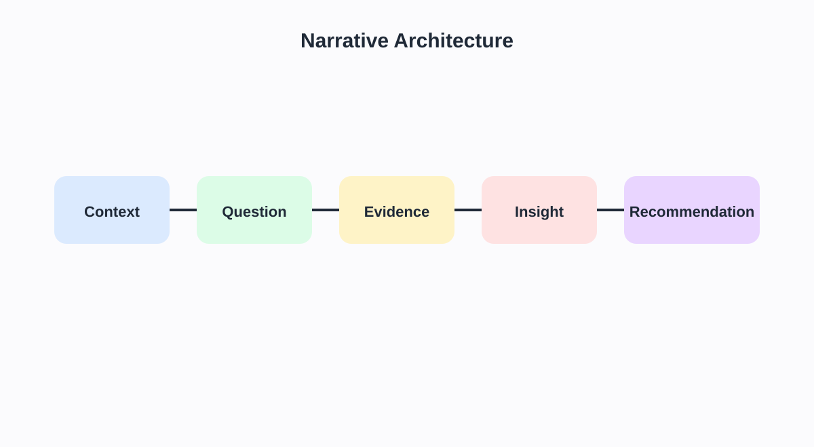

<!-- _class: lead -->
# Semana 8
## Visualizacion explicativa y storytelling tecnico

- No basta con encontrar patrones: hay que comunicarlos con estructura y evidencia
- Meta: transformar analisis en narrativa visual accionable

---

## Objetivos de la semana

- Distinguir dashboard exploratorio de pieza explicativa.
- Construir secuencias visuales con contexto, evidencia e implicancia.
- Escribir titulos y anotaciones que guien la interpretacion sin distorsionar el dato.

---

## Agenda sugerida de las 4 horas

| Tramo | Tiempo | Actividad |
|---|---:|---|
| Apertura | 0:00 - 0:20 | Recap del dashboard analitico y objetivo narrativo |
| Teoria | 0:20 - 1:10 | Storytelling, arquitectura narrativa y valor explicativo |
| Demo | 1:10 - 2:00 | Transformar una vista exploratoria en una historia en Tableau |
| Laboratorio | 2:00 - 3:25 | Secuencia de 3 a 5 vistas con anotaciones y cierre |
| Cierre | 3:25 - 4:00 | Mini presentaciones y feedback de claridad narrativa |

---

## Fundamento teorico

- Storytelling con datos no significa adornar resultados.
- Significa reducir ambiguedad y guiar el proceso inferencial del lector.
- Componentes minimos:
  - contexto
  - pregunta
  - evidencia
  - insight
  - recomendacion

---

## Arquitectura narrativa

- La secuencia importa:
  - primero orienta
  - luego demuestra
  - por ultimo recomienda

---

## De observacion a insight accionable

- Una observacion no es suficiente.
- Una narrativa rigurosa convierte observaciones en implicancias y luego en accion.

---

## Tecnicas de storytelling tecnico

- Titulos analiticos:
  - "La region sur cae 18% en margen" y no "Margen por region"
- Anotaciones con foco.
- Uso selectivo del color.
- Contexto metodologico cuando:
  - hubo limpieza relevante
  - la serie esta incompleta
  - existe limitacion interpretativa

---

## Principios para buenos titulos y anotaciones

- Un titulo debe responder:
  - que paso
  - donde
  - respecto a que referencia
- Una anotacion debe:
  - señalar un punto importante
  - reducir ambiguedad
  - no duplicar lo evidente
- Regla:
  - si el texto no cambia la interpretacion, probablemente sobra.

---

## Plantilla narrativa reutilizable

1. Contexto:
   - cual es el proceso o problema?
2. Pregunta:
   - que queremos entender?
3. Evidencia:
   - que vistas sostienen el argumento?
4. Insight:
   - que significa el patron?
5. Recomendacion:
   - que se deberia hacer?

---

## Tableau Story y dashboards curados

- `Story`: secuencia guiada para exposicion.
- `Dashboard`: espacio mas flexible para exploracion controlada.
- Regla de diseño:
  - una vista explicativa debe responder una sola pregunta central.
- Quitar no es perder: es ganar claridad.

---

## Laboratorio guiado

1. Elegir un hallazgo principal.
2. Convertir un dashboard exploratorio en una secuencia de 3 a 5 vistas.
3. Agregar:
   - titulo interpretativo
   - anotacion
   - cierre con recomendacion
4. Preparar defensa oral de tres minutos.

---

## Errores frecuentes

- Contar demasiadas cosas en una sola historia.
- Repetir lo que el grafico ya muestra.
- Introducir recomendacion que no se desprende de la evidencia.
- Sobredramatizar hallazgos debiles.

---

## Preguntas de clase

- Que parte de tu historia podria entenderse mal sin anotaciones?
- Cual es tu afirmacion mas fuerte y con que evidencia se sostiene?
- Que deberia recordar el publico 24 horas despues de la presentacion?

---

## Referencias

- Knaflic, *Storytelling with Data*
- Kirk, *Data Visualisation*
- Cairo, *How Charts Lie*
