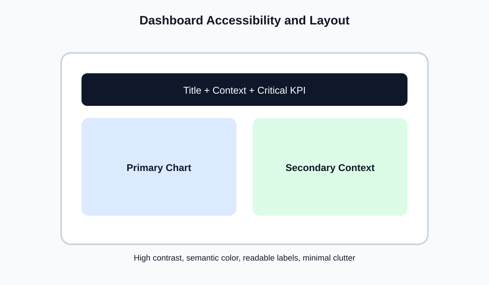

<!-- _class: lead -->
# Semana 9
## Accesibilidad, jerarquia visual y diseno de dashboards

- Buen diseno = menos friccion cognitiva
- Meta: producir dashboards claros, accesibles y orientados a lectura rapida

---

## Objetivos de la semana

- Aplicar principios de percepcion y Gestalt.
- Mejorar contraste, layout, color y legibilidad.
- Evaluar usabilidad y accesibilidad del dashboard.

---

## Agenda sugerida de las 4 horas

| Tramo | Tiempo | Actividad |
|---|---:|---|
| Apertura | 0:00 - 0:20 | Recap del storytelling y definicion de objetivos de lectura |
| Teoria | 0:20 - 1:15 | Gestalt, preatencion, accesibilidad y jerarquia visual |
| Demo | 1:15 - 2:00 | Layout, containers, color y tipografia en Tableau |
| Laboratorio | 2:00 - 3:25 | Rediseño de un dashboard existente con checklist |
| Cierre | 3:25 - 4:00 | Before/after y priorizacion de mejoras |

---

## Fundamento teorico

- El diseño visual organiza atencion.
- La teoria perceptual importa porque el usuario:
  - no lee todo
  - no mira todo al mismo tiempo
  - prioriza automaticamente ciertos estimulos
- Principios utiles:
  - figura-fondo
  - proximidad
  - similitud
  - continuidad

---

## Layout recomendado

- Titulo y contexto arriba.
- Vista principal al centro.
- Contexto secundario al costado o debajo.
- Filtros solo si agregan valor real.

---

## Reglas de accesibilidad

- No depender solo del color.
- Usar contraste suficiente.
- Tipografias legibles.
- Etiquetas con lenguaje claro.
- Paletas compatibles con daltonismo.
- Cuidar tamaños minimos para pantallas y proyeccion.

---

## Jerarquia visual y economia

- Un dashboard debe tener un punto de entrada claro.
- Quitar elementos innecesarios reduce carga cognitiva.
- El espacio en blanco:
  - separa
  - agrupa
  - ordena
- Las leyendas deben ser visibles y, si es posible, evitables mediante etiquetado directo.

---

## Tableau y diseno de interfaz

- `Containers` horizontales y verticales.
- Device layout.
- Spacing y padding.
- Control de tipografia, alineacion y formatos.
- Evaluacion empirica:
  - el usuario entiende la idea principal en menos de un minuto?

---

## Checklist de accesibilidad visual

- Hay contraste suficiente entre fondo y texto?
- El color tiene semantica estable?
- Las categorias pueden distinguirse aun sin color?
- El tamaño minimo de fuente resiste una clase proyectada?
- Las etiquetas importantes estan visibles sin hover?

---

## Color: semantica y control

- Color secuencial:
  - para magnitud creciente
- Color divergente:
  - para desviacion respecto a un centro
- Color categorial:
  - para grupos discretos
- Error clasico:
  - usar una paleta bonita pero teoricamente equivocada para el tipo de variable.

---

## Laboratorio guiado

1. Tomar un dashboard previo.
2. Rediseñar estructura y color.
3. Aplicar checklist de accesibilidad.
4. Preparar comparacion antes vs despues.

---

## Errores frecuentes

- Exceso de KPIs sin contexto.
- Colores intensos para datos secundarios.
- Contraste insuficiente en proyeccion.
- Layout que obliga a buscar la vista principal.

---

## Preguntas para cierre

- Que elemento compite indebidamente con la vista principal?
- Que cambio visual mejora mas la legibilidad con menor esfuerzo?
- Que parte del dashboard depende demasiado del color?

---

## Referencias

- Colin Ware, *Information Visualization*
- Stephen Few, *Information Dashboard Design*
- WCAG, principios de accesibilidad
