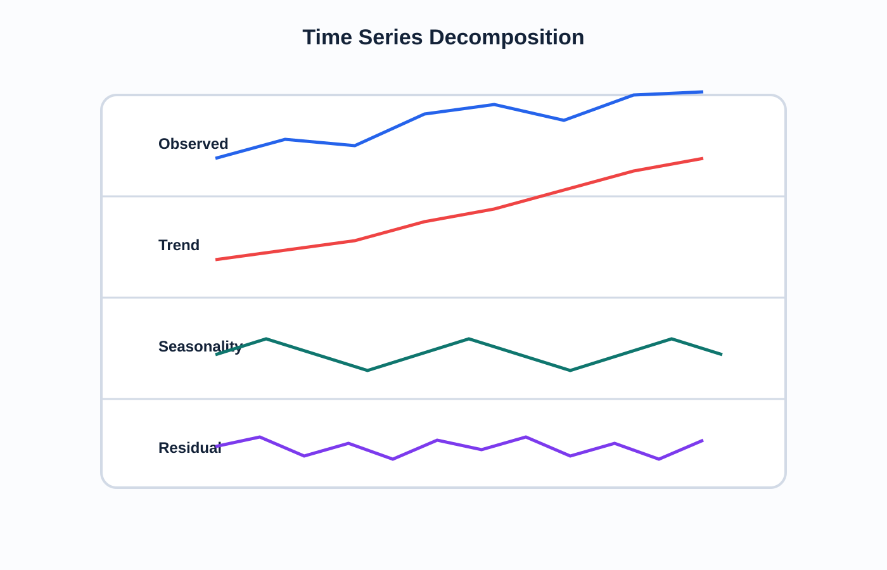

<!-- _class: lead -->
# Semana 10
## Visualizacion longitudinal y analisis temporal

- El tiempo no es solo una variable mas: impone orden, continuidad y comparabilidad
- Meta: construir lecturas temporales defendibles

---

## Objetivos de la semana

- Diferenciar tendencia, estacionalidad, ruido y quiebre.
- Usar granularidad temporal correcta.
- Aplicar `running total`, `moving average` y comparaciones interperiodo.

---

## Agenda sugerida de las 4 horas

| Tramo | Tiempo | Actividad |
|---|---:|---|
| Apertura | 0:00 - 0:20 | Recap del rediseño y pregunta temporal del dia |
| Teoria | 0:20 - 1:15 | Serie temporal, tendencia, estacionalidad y forecast |
| Demo | 1:15 - 2:00 | Fechas, `moving average`, `running total` y comparaciones en Tableau |
| Laboratorio | 2:00 - 3:25 | Dashboard temporal con insight y advertencia metodologica |
| Cierre | 3:25 - 4:00 | Discusion sobre limites del forecasting visual |

---

## Fundamento teorico

- Una serie temporal exige preservar:
  - orden
  - ventana
  - escala
  - periodicidad
- La mala visualizacion temporal suele nacer de:
  - granularidad mezclada
  - ventanas incompletas
  - comparaciones no homologas

---

## Marco de lectura temporal

- La serie observada combina señal y ruido.
- El suavizado ayuda a leer patron, pero no reemplaza al dato observado.

---

## Descomposicion temporal

- Elementos clasicos:
  - observacion
  - tendencia
  - estacionalidad
  - residual
- Esta distincion mejora tanto la lectura como el reporte de hallazgos.

---

## Tecnicas en Tableau

- Fechas continuas vs discretas.
- Jerarquias temporales.
- `Running total`.
- `Moving average`.
- Comparacion con periodo previo.
- Forecasting basico con advertencia metodologica.

---

## Criterios teoricos

- Una tendencia sostenida no se infiere por un solo punto extremo.
- Estacionalidad no debe confundirse con crecimiento estructural.
- Un forecast en Tableau es orientativo, no evidencia causal ni pronostico robusto por si solo.

---

## Preguntas temporales canonicas

- Que tan rapido cambia?
- El cambio es sostenido o puntual?
- Existen ciclos repetitivos?
- El comportamiento reciente contradice el historico?
- Hay quiebres luego de un evento o intervencion?

---

## Fallos interpretativos comunes

- Comparar periodos con distinta longitud.
- Ignorar rezagos.
- Leer ruido como señal.
- Confundir recuperacion temporal con cambio estructural.
- Inferir causalidad por coincidencia temporal.

---

## Laboratorio guiado

1. Construir una vista temporal principal.
2. Agregar una comparacion interperiodo.
3. Crear una metrica acumulada o suavizada.
4. Redactar un insight temporal y su limitacion.

---

## Errores frecuentes

- Comparar meses parciales con meses completos.
- Usar dual axis sin razon clara.
- Elegir una granularidad que oculta el fenomeno.
- Tomar el forecast como prediccion final.

---

## Preguntas para clase

- Que seria una buena linea base para comparar esta serie?
- Que evento externo podria explicar un quiebre sin que la vista lo pruebe?
- Que parte de la serie necesitaria mas contexto antes de concluir algo?

---

## Referencias

- Few, *Now You See It*
- Kirk, *Data Visualisation*
- Cairo, *How Charts Lie*
