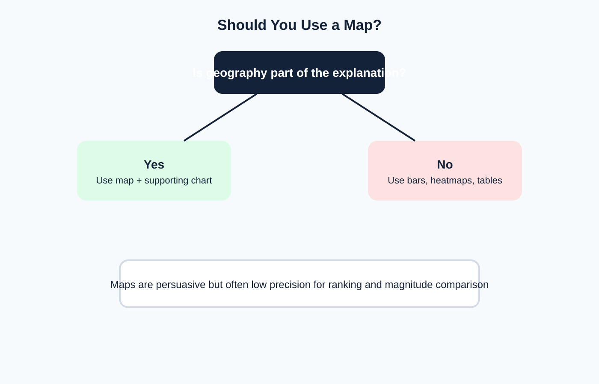

<!-- _class: lead -->
# Semana 11
## Comparacion transversal, vistas multigrupo y mapas

- Comparar exige precision, contexto y escala compartida
- Meta: elegir entre barras, heatmaps, mapas, treemaps y small multiples con criterio

---

## Objetivos de la semana

- Diseñar comparaciones entre categorias, segmentos y regiones.
- Evaluar cuando un mapa agrega valor real.
- Construir vistas multigrupo sin perder legibilidad.

---

## Agenda sugerida de las 4 horas

| Tramo | Tiempo | Actividad |
|---|---:|---|
| Apertura | 0:00 - 0:20 | Recap temporal y objetivos de comparacion |
| Teoria | 0:20 - 1:15 | Bares ordenadas, mapas, heatmaps y small multiples |
| Demo | 1:15 - 2:00 | Roles geograficos y vistas comparativas en Tableau |
| Laboratorio | 2:00 - 3:25 | Vista multigrupo + componente geografico si aplica |
| Cierre | 3:25 - 4:00 | Discusion sobre precision comparativa y uso de mapas |

---

## Fundamento teorico

- Las comparaciones son mas fuertes cuando:
  - usan una escala comun
  - ordenan por significado
  - hacen visible la referencia
- Los mapas son expresivos pero de baja precision para ranking fino.

---

## Toolkit de vistas comparativas

- Barras ordenadas para ranking.
- Heatmaps para intensidad matricial.
- Treemaps para composicion aproximada.
- Small multiples para comparacion repetida con misma estructura.

---

## Decision sobre uso de mapas

- Usar mapa solo si la geografia forma parte de la explicacion.
- Si la pregunta principal es ranking, una barra ordenada casi siempre supera al mapa.

---

## Reglas para visualizacion geografica

- Considerar tasas y normalizacion.
- Acompanar el mapa con una vista de contexto.
- No confundir area territorial con magnitud.
- Evitar saturacion cromatica sin escala interpretable.

---

## Normalizacion antes de comparar

- Totales absolutos:
  - utiles para volumen
- Tasas:
  - utiles para intensidad o riesgo
- Per capita:
  - utiles para comparacion poblacional
- Participacion porcentual:
  - utiles para composicion

---

## Small multiples: por que son tan potentes

- Mantienen escala y estructura constantes.
- Reducen la necesidad de cambiar de contexto visual.
- Permiten comparar patrones repetidos sin saturar una sola vista.
- Funcionan muy bien para:
  - regiones
  - categorias
  - periodos

---

## Tableau en esta semana

- `Geographic roles`
- `Symbol maps`
- `Filled maps`
- `Heatmaps`
- `Highlight tables`
- `Small multiples` con filas y columnas repetidas

---

## Laboratorio guiado

1. Construir una vista comparativa multigrupo.
2. Si la fuente lo permite, construir una vista geografica.
3. Acompañar el mapa con una barra ordenada o tabla.
4. Justificar por que la geografia agrega o no agrega valor.

---

## Errores frecuentes

- Usar mapa por prestigio visual.
- Comparar totales absolutos donde se requieren tasas.
- Construir small multiples sin escala consistente.
- Heatmaps sin leyenda util.

---

## Preguntas para cierre

- Si quitas el mapa, la conclusion principal cambia?
- Que variable deberia normalizarse antes de compararla entre regiones?
- Cuando un small multiple supera a un dashboard con filtros?

---

## Referencias

- Munzner, *Visualization Analysis and Design*
- Few, *Show Me the Numbers*
- Cairo, *The Truthful Art*
