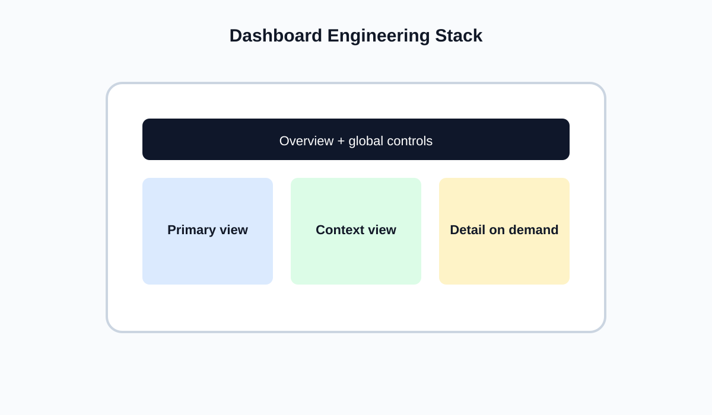

<!-- _class: lead -->
# Semana 13
## Ingenieria de dashboards, interactividad y publicacion

- Un dashboard final es una arquitectura de lectura y accion
- Meta: ensamblar un producto navegable, estable y publicable

---

## Objetivos de la semana

- Integrar vistas con jerarquia clara.
- Diseñar interaccion con intencion analitica.
- Revisar rendimiento y preparar publicacion.

---

## Agenda sugerida de las 4 horas

| Tramo | Tiempo | Actividad |
|---|---:|---|
| Apertura | 0:00 - 0:20 | Recap de tecnicas avanzadas y foco de entrega final |
| Teoria | 0:20 - 1:10 | Arquitectura de dashboard, interaccion y rendimiento |
| Demo | 1:10 - 2:00 | `Actions`, `viz in tooltip`, publicacion y formatos finales |
| Laboratorio | 2:00 - 3:25 | Ensamblaje del dashboard final y pruebas de usuario |
| Cierre | 3:25 - 4:00 | Ajustes finales y checklist previo a defensa |

---

## Fundamento teorico

- La interactividad solo agrega valor si reduce esfuerzo y aumenta control cognitivo.
- Todo dashboard final debe responder:
  - cual es la vista principal
  - que acciones estan permitidas
  - como se conserva el contexto
  - cuanto tarda en responder

---

## Arquitectura del dashboard

- Resumen global arriba.
- Vista principal con foco.
- Vista de contexto.
- Detalle bajo demanda.

---

## Tipos de interaccion y su sentido

- `Filter actions`: cambian el universo observado.
- `Highlight actions`: comparan sin perder contexto.
- `Parameter actions`: cambian escenario o metrica.
- `Viz in tooltip`: agrega detalle sin saturar el layout.

- Regla:
  - una accion debe existir porque mejora una tarea concreta del usuario.

---

## Rendimiento

- Menos hojas innecesarias.
- Menos filtros redundantes.
- Calculos costosos solo cuando son realmente utiles.
- Granularidad controlada.
- Extraccion cuando la fuente lo amerite.

---

## Publicacion y comparacion con Power BI

- `Tableau Public`:
  - rapido para compartir
  - cuidar sensibilidad del dato
- `Power BI`:
  - fuerte en reporting empresarial y distribucion corporativa
- En este curso:
  - `Tableau` sigue siendo el stack central por coherencia pedagogica

---

## Formatos finales de salida

- `Dashboard`:
  - ideal para exploracion guiada e interactividad
- `Story`:
  - ideal para secuencia explicativa y presentacion
- `Reporte ejecutivo`:
  - ideal para toma de decision con poco tiempo
- `Deck oral`:
  - ideal para defensa final y presentacion de insights

---

## Pruebas de usabilidad recomendadas

- Pedir a un compañero que responda una pregunta concreta con el dashboard.
- Medir:
  - tiempo de orientacion
  - numero de clics
  - errores de interpretacion
- Observar si encuentra:
  - metrica principal
  - filtros
  - vista contextual
  - detalle bajo demanda

---

## Checklist antes de publicar

- Los datos son publicables?
- Las metricas coinciden con las definiciones del curso?
- El dashboard tiene una vista dominante?
- Las acciones interactivas son necesarias?
- La carga es razonable?

---

## Laboratorio guiado

1. Ensamblar dashboard final.
2. Agregar al menos una accion interactiva justificada.
3. Revisar tiempo de carga y consistencia visual.
4. Dejar version lista para publicar.

---

## Errores frecuentes

- Interactividad por exhibicion.
- Saturacion de filtros visibles.
- Vista principal sin foco claro.
- Publicacion de datos sensibles sin revisar.

---

## Preguntas de cierre

- Que accion del dashboard agrega mas valor y cual podria eliminarse?
- Que parte del layout sigue generando duda o esfuerzo?
- Si tuvieras que reducirlo a una sola pantalla, que dejarias?

---

## Referencias

- Few, *Information Dashboard Design*
- Kirk, *Data Visualisation*
- Tableau Public, buenas practicas
