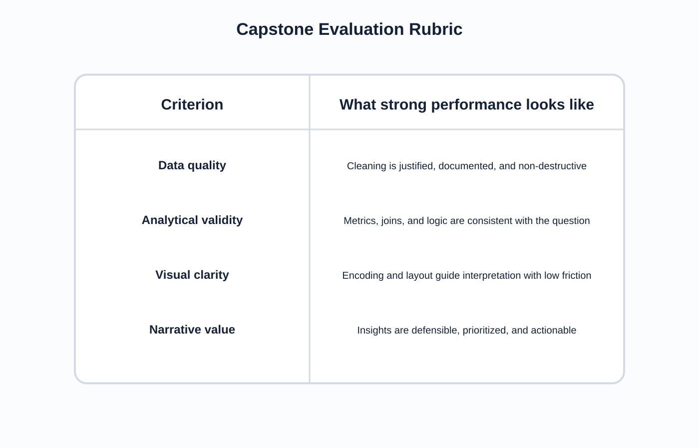

<!-- _class: lead -->
# Semana 14
## Proyecto integrador, defensa tecnica y cierre del curso

- La defensa final debe mostrar dominio del pipeline completo
- Meta: presentar una solucion visual clara, valida y accionable

---

## Objetivos de la semana

- Defender decisiones de datos, modelado, calculo y diseno.
- Presentar una historia visual coherente.
- Dejar una entrega publicable y util como portafolio.

---

## Agenda sugerida de las 4 horas

| Tramo | Tiempo | Actividad |
|---|---:|---|
| Apertura | 0:00 - 0:20 | Recordatorio de rubrica y estructura de defensa |
| Preparacion | 0:20 - 1:00 | Ajustes finales de dashboard, narrativa y evidencia |
| Ensayo | 1:00 - 1:45 | Presentaciones cortas con feedback tecnico |
| Defensa | 1:45 - 3:30 | Exposiciones finales y preguntas metodologicas |
| Cierre | 3:30 - 4:00 | Retroalimentacion global y recomendaciones de portafolio |

---

## Fundamento teorico

- Una presentacion final fuerte no exhibe solamente pantallas bonitas.
- Debe demostrar coherencia entre:
  - problema
  - datos
  - preparacion
  - analisis
  - visualizacion
  - recomendacion

---

## Estructura de defensa

- Problema
- Datos
- Preparacion
- Analisis
- Visualizacion
- Recomendacion

---

## Rubrica de evaluacion

- Calidad del dato.
- Validez analitica.
- Claridad visual.
- Valor narrativo.

---

## Estructura recomendada de exposicion

1. Contexto y pregunta.
2. Fuente y limitaciones.
3. Transformaciones y limpieza.
4. Hallazgos principales.
5. Dashboard final.
6. Recomendacion accionable.
7. Riesgos y limites.

---

## Checklist previo a la defensa

- Las metricas estan definidas?
- Los joins fueron validados?
- Los titulos dicen algo interpretable?
- El dashboard tiene foco?
- Las recomendaciones salen de la evidencia?
- Los limites del dato estan explicitados?

---

## Preguntas esperables en la defensa

- Por que elegiste ese dataset y no otro?
- Que problema de calidad fue mas critico?
- Como validaste que tu modelo no duplicaba informacion?
- Por que ese grafico y no otro?
- Que conclusion es fuerte y cual es aun exploratoria?

---

## Del proyecto final al portafolio

- Simplificar narrativa para publico externo.
- Mejorar portada y contexto.
- Explicitar problema, datos y valor generado.
- Publicar version navegable o capturas comentadas.
- Incluir una nota metodologica breve sobre pipeline y limitaciones.

---

## Laboratorio guiado

1. Ensayo final.
2. Revision tecnica entre pares.
3. Ajuste de layout, textos y navegacion.
4. Presentacion final con preguntas metodologicas.

---

## Errores frecuentes

- Defender la estetica y no la logica.
- Ocultar limitaciones del dataset.
- Mostrar demasiadas vistas y pocas conclusiones.
- Presentar recomendaciones desconectadas de la evidencia.

---

## Cierre del curso

- Lo importante no es solo aprender Tableau.
- El objetivo es aprender a:
  - leer estructura de datos
  - elegir representaciones honestas
  - construir dashboards defendibles
  - comunicar decisiones con evidencia

---

## Referencias

- Munzner, *Visualization Analysis and Design*
- Cairo, *The Truthful Art*
- Knaflic, *Storytelling with Data*
