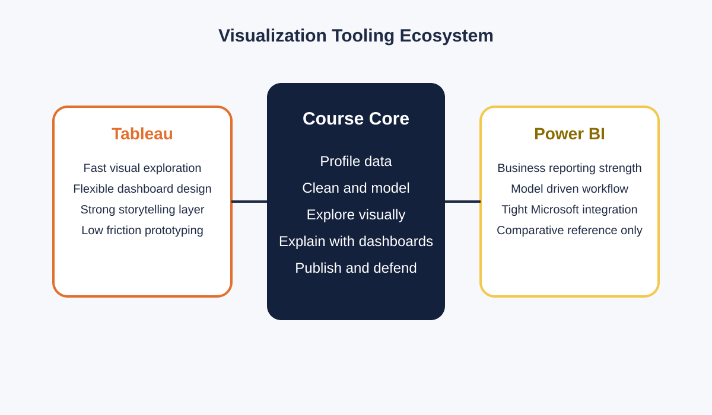

# Semana 1: Introduccion tecnica al curso y ecosistema de visualizacion

## Slide 1. Proposito de la semana

- Comprender que la visualizacion es una capa de razonamiento, no solo de presentacion.
- Distinguir entre exploracion, explicacion y storytelling.
- Configurar el entorno de trabajo en Tableau y definir el dataset base del ciclo.

---

## Slide 2. Fundamento teorico

- La visualizacion externaliza cognicion: reduce carga de memoria de trabajo y permite detectar patrones que no emergen en tablas.
- Segun Munzner, una visualizacion util conecta:
  - tarea analitica
  - estructura del dato
  - codificacion visual
  - interaccion
- La pregunta correcta no es "que grafico se ve mejor", sino "que representacion preserva mejor la estructura relevante del dato".

---

## Slide 3. Diferencia entre tipos de trabajo visual

| Tipo | Objetivo | Usuario dominante | Producto tipico |
|---|---|---|---|
| Exploratorio | Descubrir patrones | Analista | Hoja o dashboard de trabajo |
| Explicativo | Comunicar un hallazgo | Stakeholder | Dashboard curado o historia |
| Storytelling | Guiar interpretacion y decision | Ejecutivo o cliente | Presentacion narrativa |

- En este curso la secuencia sera: perfilado -> limpieza -> modelado -> exploracion -> explicacion -> dashboard final.

---

## Slide 4. Ecosistema de herramientas

- `Tableau` sera la herramienta principal porque favorece exploracion rapida, prototipado interactivo y narrativa visual.
- `Power BI` aparecera como contraste metodologico, no como stack paralelo.
- `Python` se usara solo cuando agregue valor directo al flujo del curso.

---

## Slide 5. Tableau: arquitectura conceptual minima

- Fuente de datos:
  - archivo, Excel, CSV, base de datos, extract o live
- Hoja:
  - unidad minima de analisis visual
- Dashboard:
  - combinacion de vistas para comparacion, monitoreo o exploracion
- Story:
  - secuencia explicativa de vistas
- Componentes clave:
  - data pane
  - shelves
  - marks card
  - filters
  - legends

---

## Slide 6. Laboratorio guiado

1. Instalar y abrir Tableau Desktop o Tableau Public.
2. Conectar un dataset real en CSV o Excel.
3. Identificar dimensiones, medidas y campos de fecha.
4. Construir:
   - una vista de comparacion por categoria
   - una vista temporal o una dispersion simple
5. Guardar el workbook con convencion estable de nombres.

---

## Slide 7. Errores conceptuales que deben evitarse desde el inicio

- Elegir la herramienta antes de definir la pregunta analitica.
- Confundir "interactividad" con "claridad".
- Mezclar campos mal tipados desde la primera conexion.
- Construir dashboards sin identificar primero unidad de analisis y granularidad.
- Usar defaults de software como si fueran decisiones teoricamente neutras.

---

## Slide 8. Cierre teorico y referencias

- Idea central: la calidad visual depende de la calidad del pipeline previo.
- Referencias sugeridas:
  - Tamara Munzner, *Visualization Analysis and Design*
  - Colin Ware, *Information Visualization*
  - Stephen Few, *Show Me the Numbers*

