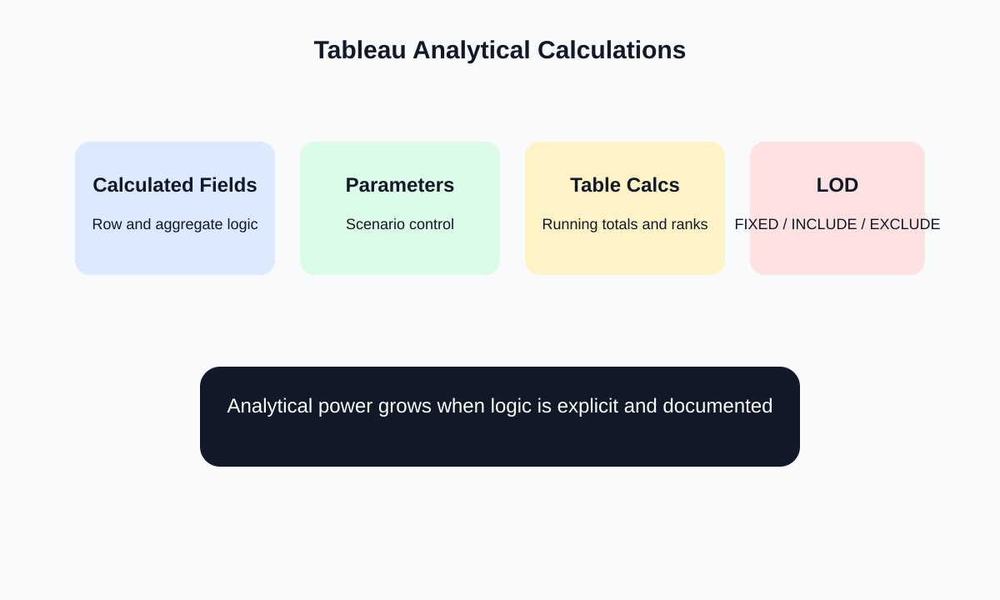

# Semana 7: Calculos analiticos, parametros, table calculations y LOD

## Slide 1. Proposito de la semana

- Expandir el dashboard con logica analitica explicita.
- Diferenciar calculos a nivel fila, agregado, tabla y nivel de detalle.
- Introducir `LOD` para resolver preguntas que la agregacion simple no puede responder bien.

---

## Slide 2. Fundamento teorico

- Un dashboard serio no solo muestra datos; tambien formaliza operaciones conceptuales.
- La robustez analitica depende de saber donde ocurre cada calculo.
- Pregunta central:
  - el resultado se calcula por fila, por vista, por particion o por nivel fijo?

---

## Slide 3. Mapa de calculos

- Calculated fields:
  - logica de negocio reusable
- Parameters:
  - control de escenarios
- Table calculations:
  - dependen de la vista y particion
- LOD:
  - fijan o expanden granularidad analitica

---

## Slide 4. Tecnicas concretas

- Campos calculados:
  - margen
  - ratio
  - ticket promedio
  - banderas logicas
- Table calculations:
  - percent of total
  - running total
  - moving average
  - rank
- LOD:
  - `{ FIXED [Region] : SUM([Sales]) }`
  - `{ INCLUDE [Category] : AVG([Profit]) }`
  - `{ EXCLUDE [Subcategory] : SUM([Sales]) }`

---

## Slide 5. Criterios teoricos de uso

- Usar `table calculations` cuando el calculo depende de la vista mostrada.
- Usar `LOD` cuando la pregunta requiere un nivel de detalle distinto al de la visualizacion actual.
- Documentar siempre:
  - definicion de metrica
  - nivel de calculo
  - supuestos

---

## Slide 6. Laboratorio guiado

1. Crear cuatro metricas derivadas.
2. Incorporar:
   - un parametro
   - una table calculation
   - un calculo `LOD`
3. Explicar verbalmente por que cada tecnica fue usada y no otra.

---

## Slide 7. Errores frecuentes

- Mezclar agregados y no agregados sin entender el error conceptual.
- Usar `LOD` como solucion automatica sin comprender granularidad.
- Mostrar demasiadas metricas derivadas que el usuario no puede interpretar.
- Calcular sobre una vista mal particionada.

---

## Slide 8. Referencias

- Tableau Documentation, `LOD Expressions`
- Munzner, *Visualization Analysis and Design*
- Few, *Show Me the Numbers*

