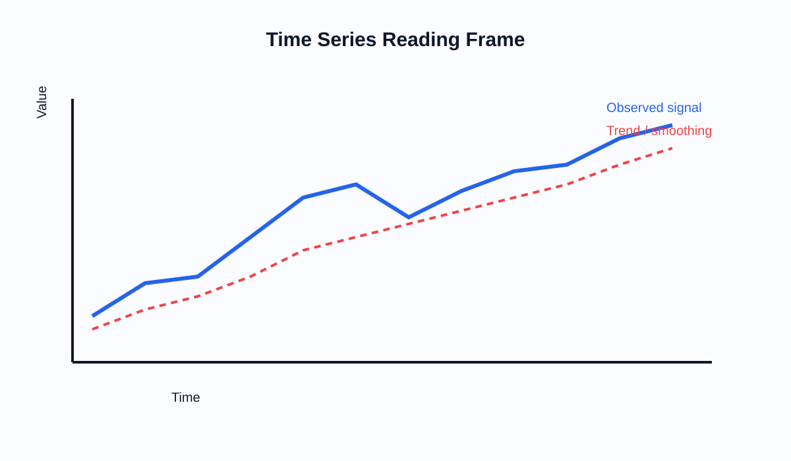

# Semana 10: Visualizacion longitudinal y analisis temporal

## Slide 1. Proposito de la semana

- Leer procesos que evolucionan en el tiempo.
- Distinguir tendencia, ruido, estacionalidad y cambio estructural.
- Construir vistas temporales interpretables en Tableau.

---

## Slide 2. Fundamento teorico

- El tiempo no es solo una dimension mas: impone orden y continuidad.
- Una buena visualizacion temporal debe preservar:
  - secuencia
  - escala
  - comparabilidad entre periodos
- Preguntas centrales:
  - crece o cae?
  - se estabiliza?
  - hay estacionalidad?
  - hay quiebres?

---

## Slide 3. Marco de lectura temporal

- La linea observada muestra señal y ruido.
- Las tecnicas de suavizado ayudan a leer patron, no a reemplazar dato.
- Toda comparacion temporal depende de granularidad correcta:
  - dia, semana, mes, trimestre, ano

---

## Slide 4. Tecnicas concretas

- Fechas continuas vs discretas en Tableau.
- Jerarquias temporales.
- Moving average.
- Running total.
- YoY y comparacion con periodo previo.
- Forecasting basico:
  - utilidad limitada
  - requiere explicitar supuestos

---

## Slide 5. Criterios teoricos de interpretacion

- Una tendencia cambia si la pendiente cambia de forma sostenida.
- Estacionalidad no es tendencia.
- Una comparacion entre periodos debe controlar ventanas equivalentes.
- Un promedio movil puede ocultar eventos puntuales importantes.
- Forecasting visual no reemplaza modelado formal.

---

## Slide 6. Laboratorio guiado

1. Crear una vista temporal base.
2. Agregar una comparacion interperiodo.
3. Calcular running total o moving average.
4. Formular un insight temporal con sus limites interpretativos.

---

## Slide 7. Errores frecuentes

- Mezclar granularidades temporales sin advertirlo.
- Comparar ventanas incompletas.
- Usar dual axis sin justificacion analitica.
- Forzar forecast sobre series sin estructura interpretable.

---

## Slide 8. Referencias

- Few, *Now You See It*
- Kirk, *Data Visualisation*
- Cairo, *How Charts Lie*

