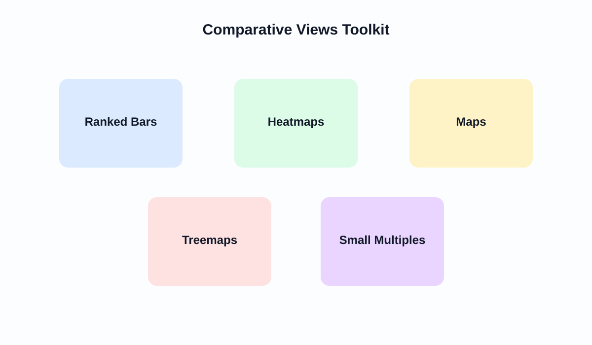

# Semana 11: Comparacion transversal, vistas multigrupo y mapas

## Slide 1. Proposito de la semana

- Comparar grupos, regiones, segmentos y categorias en un mismo corte.
- Elegir entre barras, heatmaps, mapas, treemaps y small multiples.
- Evitar interpretaciones engañosas en visualizacion geografica.

---

## Slide 2. Fundamento teorico

- Comparar no es solo alinear categorias; es preservar proporcionalidad y contexto.
- En visualizacion transversal importan:
  - orden
  - normalizacion
  - referencia
  - jerarquia de lectura
- Los mapas son potentes, pero faciles de usar mal.

---

## Slide 3. Toolkit de comparacion

- Ranked bars:
  - ideales para orden explicito
- Heatmaps:
  - adecuados para matrices de intensidad
- Maps:
  - utiles solo si la geografia agrega valor analitico real
- Small multiples:
  - muy potentes para comparacion consistente

---

## Slide 4. Reglas para mapas y geografia

- Mapear no siempre es la mejor opcion.
- Usar mapas cuando la ubicacion sea parte de la explicacion.
- Evitar interpretar area geografica como importancia sin normalizacion.
- Acompanar el mapa con:
  - barra ordenada
  - tasa per capita
  - tabla de contexto

---

## Slide 5. Tableau en esta semana

- Geographic roles.
- Symbol maps y filled maps.
- Heatmaps y highlight tables.
- Treemaps y small multiples.
- Orden y color por intensidad, no por capricho visual.

---

## Slide 6. Laboratorio guiado

1. Construir una vista comparativa multigrupo.
2. Si el dataset lo permite, crear una vista geografica.
3. Complementarla con una vista de contexto no geografica.
4. Justificar por que la geografia si o no agrega valor.

---

## Slide 7. Errores frecuentes

- Usar mapa solo porque existe latitud y longitud.
- Comparar totales absolutos cuando se requiere tasa.
- Treemap para preguntas que exigen ranking preciso.
- Heatmap sin escala interpretable.

---

## Slide 8. Referencias

- Munzner, *Visualization Analysis and Design*
- Few, *Show Me the Numbers*
- Cairo, *The Truthful Art*

