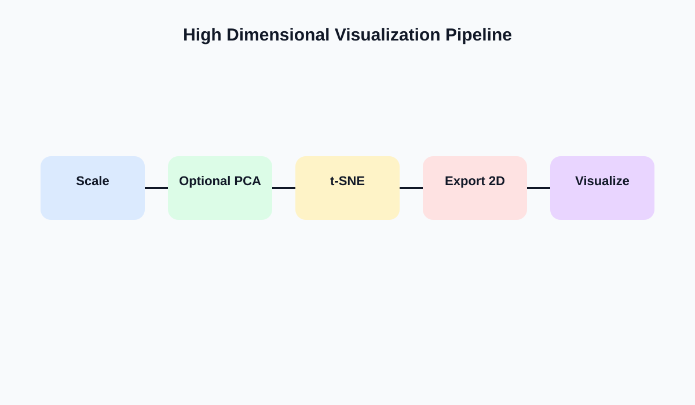

# Semana 12: Visualizacion de alta dimensionalidad con PCA y t-SNE

## Slide 1. Proposito de la semana

- Introducir la logica de reduccion de dimensionalidad para exploracion visual avanzada.
- Entender que `PCA` y `t-SNE` no son graficos sino transformaciones del espacio de datos.
- Integrar proyecciones externas dentro de Tableau.

---

## Slide 2. Fundamento teorico

- La alta dimensionalidad dificulta razonamiento visual directo.
- Reducir dimensionalidad busca representar estructura relevante en 2D o 3D.
- `PCA`:
  - proyeccion lineal
  - maximiza varianza explicada
- `t-SNE`:
  - prioriza vecindades locales
  - no preserva bien distancias globales

---

## Slide 3. Pipeline analitico recomendado

- Escalar variables.
- Aplicar `PCA` si conviene reducir ruido o dimension.
- Calcular `t-SNE` fuera de Tableau.
- Exportar coordenadas.
- Visualizar en Tableau como scatter plot anotado.

---

## Slide 4. Criterios teoricos de interpretacion

- `PCA` permite leer ejes como combinaciones lineales.
- `t-SNE` no produce ejes semanticamente interpretables en sentido clasico.
- En `t-SNE`, la proximidad local puede ser util; la distancia global no debe sobreleerse.
- Sensibilidad a:
  - semilla
  - perplexity
  - escala de entrada

---

## Slide 5. Integracion con Tableau

- El workflow realista es:
  - preparar datos en Python
  - exportar columnas `x_tsne` y `y_tsne`
  - usar color por clase, cluster o segmento
  - enriquecer tooltip con variables originales
- Tableau no calcula `t-SNE` nativamente; lo consume como resultado analitico externo.

---

## Slide 6. Laboratorio guiado

1. Cargar dataset con varias variables numericas o embedding precalculado.
2. Visualizar coordenadas 2D en Tableau.
3. Colorear por categoria o cluster.
4. Identificar agrupamientos, transiciones y outliers.
5. Escribir advertencia metodologica sobre limites interpretativos.

---

## Slide 7. Errores frecuentes

- Presentar `t-SNE` como prueba concluyente de cluster.
- Interpretar cada eje como variable original.
- Omitir que hubo transformacion previa del espacio.
- Cambiar hiperparametros hasta obtener una figura "bonita".

---

## Slide 8. Referencias

- van der Maaten y Hinton, *Visualizing Data using t-SNE*
- Jolliffe, *Principal Component Analysis*
- Cairo, *How Charts Lie*

