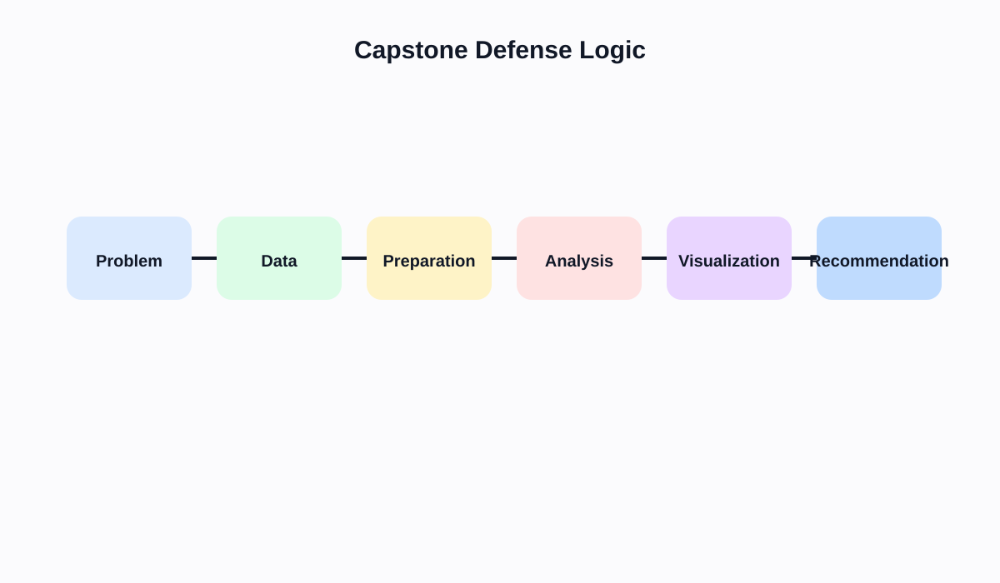

# Semana 14: Proyecto integrador, defensa tecnica y cierre del curso

## Slide 1. Proposito de la semana

- Presentar un producto visual completo y defendible.
- Justificar decisiones de datos, modelado, calculo, diseno e interpretacion.
- Cerrar el curso con un resultado publicable y util como portafolio.

---

## Slide 2. Fundamento teorico

- Una buena presentacion final no resume el curso; demuestra dominio del pipeline completo.
- La robustez teorica se evalua en la coherencia entre:
  - problema
  - datos
  - preparacion
  - analisis
  - visualizacion
  - recomendacion

---

## Slide 3. Estructura de defensa recomendada

- Problema:
  - que pregunta se intenta responder
- Datos:
  - que fuente se uso y con que limites
- Preparacion:
  - que limpieza y modelado se realizaron
- Analisis:
  - que tecnicas se usaron
- Visualizacion:
  - por que esa arquitectura de dashboard
- Recomendacion:
  - que decision o accion habilita

---

## Slide 4. Rubrica tecnica sugerida

- Correccion del perfilado inicial.
- Coherencia de limpieza y trazabilidad.
- Modelado correcto de la fuente.
- Calidad de calculos y supuestos.
- Solidez de los insights.
- Adecuacion de la codificacion visual.
- Accesibilidad y usabilidad del dashboard.
- Claridad de la defensa oral.

---

## Slide 5. Estructura de exposicion

1. Problema y contexto.
2. Fuente de datos y limitaciones.
3. Principales transformaciones.
4. Hallazgos clave.
5. Dashboard o historia final.
6. Recomendacion accionable.
7. Riesgos, sesgos y limites.

---

## Slide 6. Laboratorio guiado

1. Ensayo final de presentacion.
2. Revisión de checklist tecnico.
3. Ajuste de textos, filtros y navegacion.
4. Presentacion final con preguntas metodologicas.

---

## Slide 7. Errores frecuentes

- Defender el dashboard desde la estetica y no desde la logica analitica.
- Ocultar limitaciones del dato.
- Presentar muchas vistas y pocas conclusiones.
- Recomendacion final desligada de la evidencia.
- No distinguir hallazgo fuerte de observacion menor.

---

## Slide 8. Referencias

- Munzner, *Visualization Analysis and Design*
- Cairo, *The Truthful Art*
- Knaflic, *Storytelling with Data*

